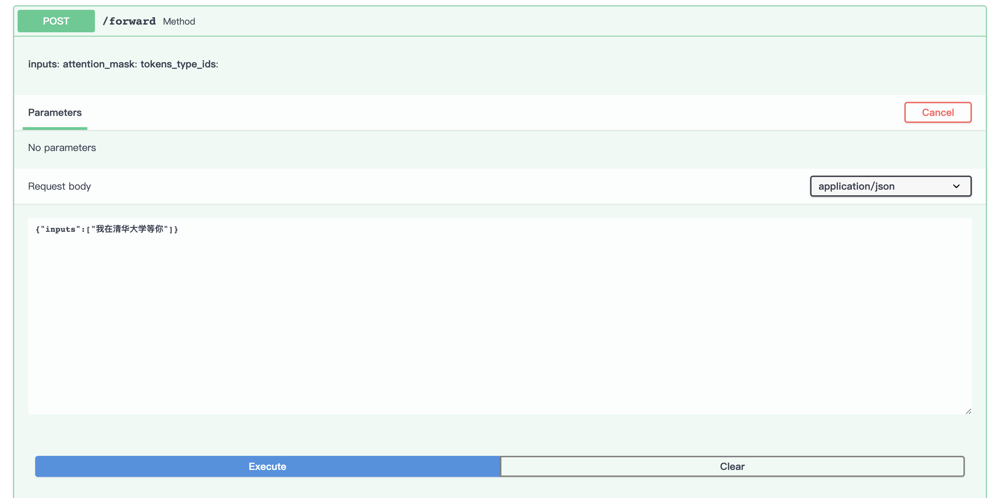
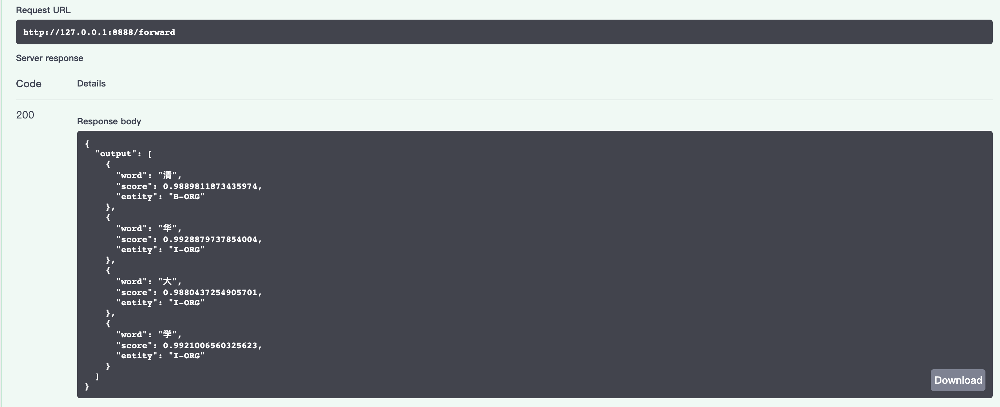

===========
fasttrainer
===========

.. image:: https://img.shields.io/pypi/v/fst2.svg
        :target: https://pypi.python.org/pypi/fst2

.. image:: https://img.shields.io/travis/superjcd/fst2.svg
        :target: https://travis-ci.com/superjcd/fst2

.. image:: https://readthedocs.org/projects/fst2/badge/?version=latest
        :target: https://fst2.readthedocs.io/en/latest/?badge=latest
        :alt: Documentation Status

* Free software: MIT license
* Documentation: https://fst2.readthedocs.io.

Overview
---------
Trainning a nlp deeplearning model is not that easy especially for the new commers, cus you have to take care of many things: preparing data, capsulizing models using pytorch or tensorflow , and worry about a lot of overwhelming staffs like gpu settings, model setting etc., that make the whole process tedious and boring. 
The goal of fst2 is just making the whole trainning process comfortable and easy based on different nlp tasks.

Features
--------
Train your nlp models fast and easily based on different nlp tasks, fst2 supports the following tasks:
  - 1 Name entity recognition.
  - 2 Textclassification or Sentiment classification.
  - 3 Text generation(comming soon).
  - 4 Feature extraction(comming soon).

Install
---------
Install fst2 is very easy, just run::
  
    pip install fst2

Quick Start
------------
The whole process of trainning a nlp model is as following::
    
    1 Prepare -> 2 Start -> 3 Use your model 

  
1 Run ``fst prepare --gen-config --gen-dir`` in the shell to choose a nlp task interactively(Type a corresponding number based on task is all you need).   
``gen-config`` flag will generate a default config file -- configs.yml just under the current working directory. The configs.yml looks like the following
::
    pipeline:
        task: ner
        do_train: true
        ...
    data:
        data_dir: fst/data_dir
        ...
    model:
        model_name_or_path: fst/pretrained_model
        ...
    tokenizer:
        tokenizer_name:
        ...
    train:
        num_train_epochs: 3
        ...
    
Most settings are ok, you can just leave them alone, if you wanna change some of the settings, just feel free to do that.

``gen-dir`` flag will genenrate a buch of default directories for you, the directory tree looks like this:
::

       fst
        ├── data
        ├── output_dir
        ├── pretrained_model
        └── result_dir

you can set a parent directory name by using ``parent-dirname`` flag follows a directory name if you don't like the default parent name -- fst.
each subdirectory name and the meaning is explained as below:

* data:  Holding necessary data files, e.g. a train data file, a label file and other necessary data files based on your seetings(like test file if you turn the ``do_test`` setting on in configs.yml), you should take care of your data format and delimiter. if let say you wanna train a ner model and you set ``do_train`` to ``true``, ``do_test`` to ``true`` , ``evaluate_during_training`` to true, and ``label_file`` to ``fst/data/labels.txt``  in the configs.yml(also the default) , then you should put some data files under data directory, like below:
::
    
    data
       ├── dev.txt
       ├── labels.txt
       ├── test.txt
       └── train.txt

and set a correct delimiter in the configs.yml. fst now only support data file with .txt extension for name entity recognition, see details for other tasks in the official documentation under ``Usage`` section. And you can download a small sample of data from ``example_datas`` under the root of this repo.

* pretrained_model: Holding pretrainned_model, the directory will looks like below:
::

    pretrained_model
        ├── config.json
        ├── pytorch_model.bin
        └── vocab.txt

you can download pretrained model from `google-reserch <https://github.com/google-research/bert>`__ for bert model. Then use `transfomers-cli <https://huggingface.co/transformers/converting_tensorflow_models.html#bert>`__ to convert tf model into pytorch model.

* output_dir: Holds models that you trained.

* result_dir: Holds performance reports and predictions based on your test file.

2 Now just run the commands to start trainning::

    fst start

3 After the train, You can use your well trained modle as input model for anthor loop of  trainning or just use the `transformers-cli serve`  command to serve your model, here is an example, use the following command to serve your model::

    transfomers-cli serve --task ner --model {your trainned modle path} --tokenizer {your trainned modle path} 

then the models should be served on the 8888 port of your localhost. Vist `SwaggerUI Page <https://localhost:8888/docs>`__ and test your modle (if you want change the host, feel free to add a ``--host`` flag). 
Here is a demo , we can use our fresh trained model to predict the location in a sentence(chinese), which is often seen in task like intent recognition.

Then the result.

Credits
-------

This package was created with Cookiecutter_ and the `audreyr/cookiecutter-pypackage`_ project template.

.. _Cookiecutter: https://github.com/audreyr/cookiecutter
.. _`audreyr/cookiecutter-pypackage`: https://github.com/audreyr/cookiecutter-pypackage
